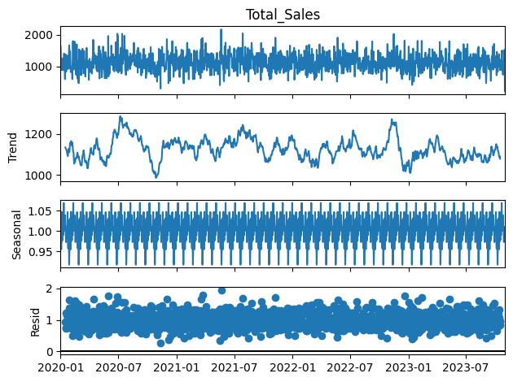
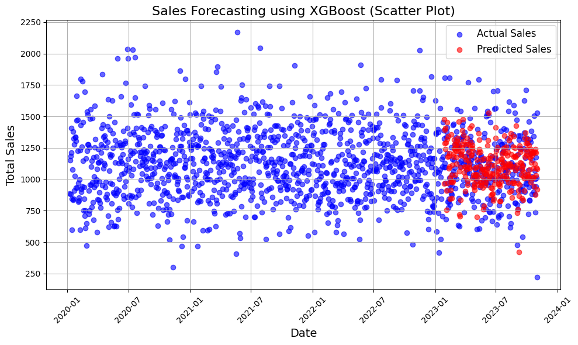
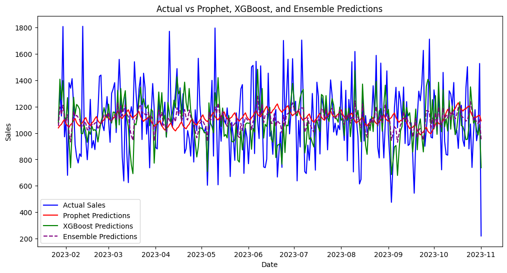

# 🛍 Retail Sales Forecasting  
### Time Series Analysis & Machine Learning Comparison

## 📌 Project Overview

This project analyzes historical retail transaction data to forecast future daily sales using two different modeling approaches:

- **Prophet** (Statistical Time Series Model)
- **XGBoost** (Machine Learning Regression with Lag Features)

The objective was to compare statistical and machine learning methods to determine which provides better predictive accuracy for retail sales forecasting.

---

## 🎯 Business Objective

Accurate demand forecasting enables retail businesses to:

- Optimize inventory planning  
- Reduce stockouts and overstocking  
- Improve supply chain efficiency  
- Plan promotions effectively  

This project demonstrates how forecasting models support data-driven retail decision-making.

---

## 🧠 Methodology

### 1️⃣ Data Preparation
- Converted transaction-level data into daily aggregated sales
- Handled missing values
- Structured the dataset for time series modeling

### 2️⃣ Exploratory Time Series Analysis
- Trend visualization  
- Sales distribution analysis  
- Seasonality identification  
- Time series decomposition  

---

## 📊 Key Visualizations

### 🔹 Total Sales Trend

---

### 🔹 Prophet Forecast (Next 30 Days)

---

### 🔹 XGBoost Forecast (Next 30 Days)

---

### 🔹 Model Performance Comparison (RMSE)

---

## 🔬 Modeling Approach

### 🔵 Model 1: Prophet
- Decomposable time series model  
- Automatically models trend and seasonality  
- Forecasted the next 30 days of sales  

### 🟢 Model 2: XGBoost

Forecasting was reframed as a supervised regression problem.

**Feature Engineering:**
- Lag 1 day  
- Lag 7 days  
- 7-day rolling mean  

This approach captures temporal dependencies through engineered features.

---

## 📈 Model Evaluation

Models were evaluated using:

- **Root Mean Squared Error (RMSE)**

The comparison highlights the strengths of statistical versus machine learning approaches in retail forecasting.

---

## 💡 Key Insights

- Retail sales exhibit clear seasonal patterns.
- Lag-based features significantly improve machine learning performance.
- Machine learning models can perform competitively with traditional time series methods when properly engineered.
- Short-term forecasts provide actionable insights for operational planning.

---

## 🛠 Tech Stack

- Python  
- Pandas, NumPy  
- Matplotlib, Seaborn  
- Statsmodels  
- Prophet  
- XGBoost  
- Scikit-learn  

---

## 👤 Author

- SK Salman
- Aspiring Data Analyst | Time Series & Predictive Modeling

